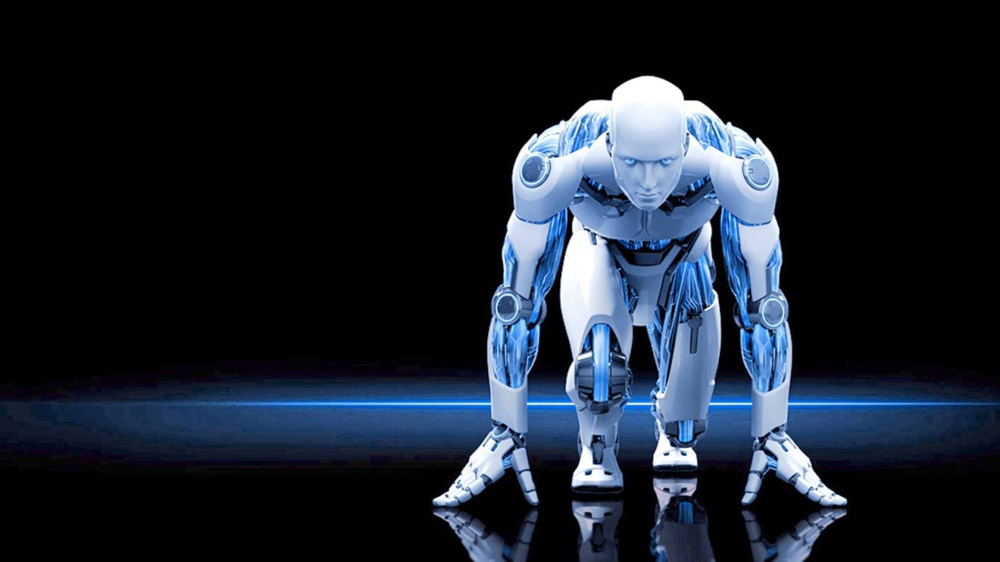

# Human vs Robot {#slug-two}

Author: Kenneth Chen

#### Machine learning, sentient algorithms

A sentient robot

## Introduction.

If and only if could machines understand what we think. If consciousness is one of the fundamentals that make a difference between living species and machines, I wonder what about a flying bird? Do humans have consciousness of flying? What about other people's mind? We can only imagine what other people think in their minds. One own's consciousness can never be shared with others. There was never a visceral experience that can be gained from somebody else consciousness. In fact, experiences are derivatives based on one's own personal experience. 

```{r hello-humanoid,echo=FALSE,fig.cap='Network',fig.align='center'}

```

## Application.

With regards to the statement above, we are now embarking upon an era of beginning of sentient machine. Can machines think? Do machine have knowledge? With the development of multi-convoluted neural networks with a powerful capacity, sentient machine or bots can speak to each other in way that we have never imagined before. Recently in FAIR (Facebook AI Research) two bots were communicating in their own language[@mckay_no_nodate]. 

```{r hello-matrix,echo=FALSE,fig.cap='Network',fig.align='center'}

```

## Future.

With a sentient machine, we can deploy their utility in foster home and lonely people who just need a touch of human interaction. By providing what seems to be missing in their hearts, sentient machine can fulfill a part of our society and can establish themselves as a small domain. There have been a few studies where interaction with human like machines improve cognitive ability of elderly in foster home[@zhuang_impact_2013]. In Japan, nurses-like robots are taking place in hospitals[@noauthor_japan_nodate][@osborne_robots_nodate]. 


